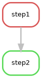
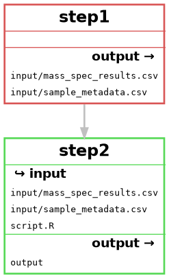

## Инструкция по запуску snakemake pipeline

1. Создайте на своем сервере, где установлен docker и snakemake, отдельную папку для работы с контейнерами и пайплайном.

2. Скачайте файлы `Dockerfile.step1`, `Dockerfile.step2`, `script.R` и `Snakefile` из этой папки на github-репозитории.

3. Откройте терминал и перейдети в рабочую директорию.

4. Соберите docker-образы следующими командами:
   ```bash
   docker build -f Dockerfile.step1 -t image_step1 .
   docker build -f Dockerfile.step2 -t image_step2 .
   ```
5. Сохраните образы в .tar файлы следующими командами:
    ```bash
    docker save image_step1 -o image_step1.tar
    docker save image_step2 -o image_step2.tar
    ```
6. Поменяйте абсолютный путь к образам в Snakefile для обоих шагов. Поле должно выглядеть так:
    ```snakefile
    container:
        "docker-archive://<твой_абсолютный_путь_до_образа>"
    ```
7. Запустите пайплайн командой
   ```bash
   snakemake --use-singularity --cores 1 output/
   ```
8. Разработанный пайплайн подчиняетмя следующим DAG
    ```bash
    snakemake --rulegraph output/ | dot -Tpng > rulegraph.png
    snakemake --filegraph output/ | dot -Tpng > filegraph.png
    ```




